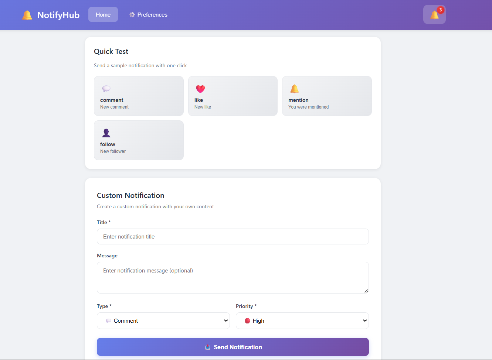
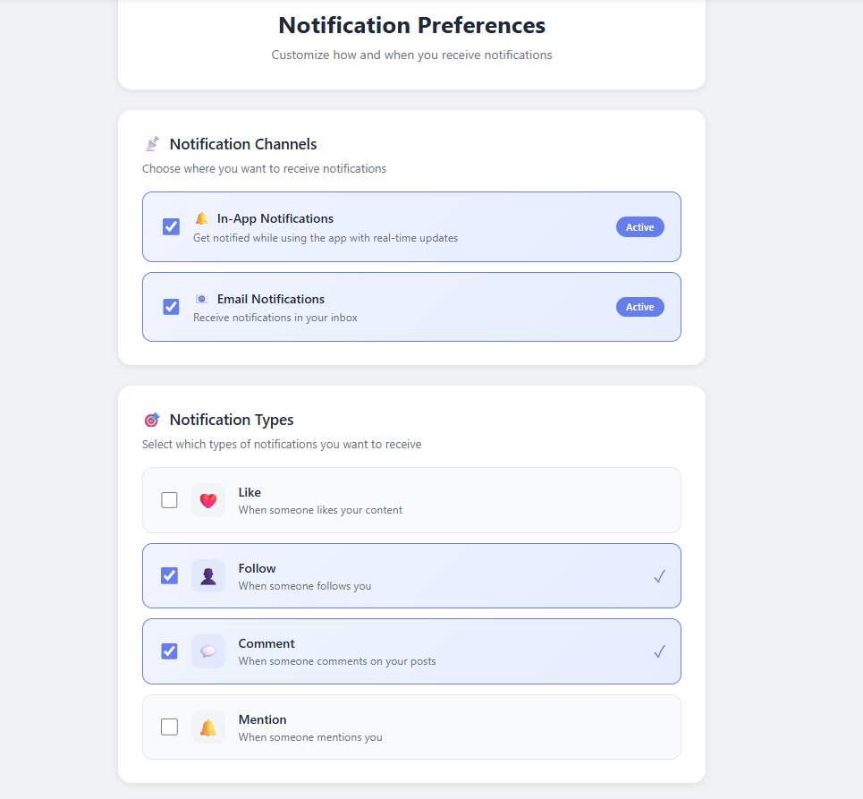
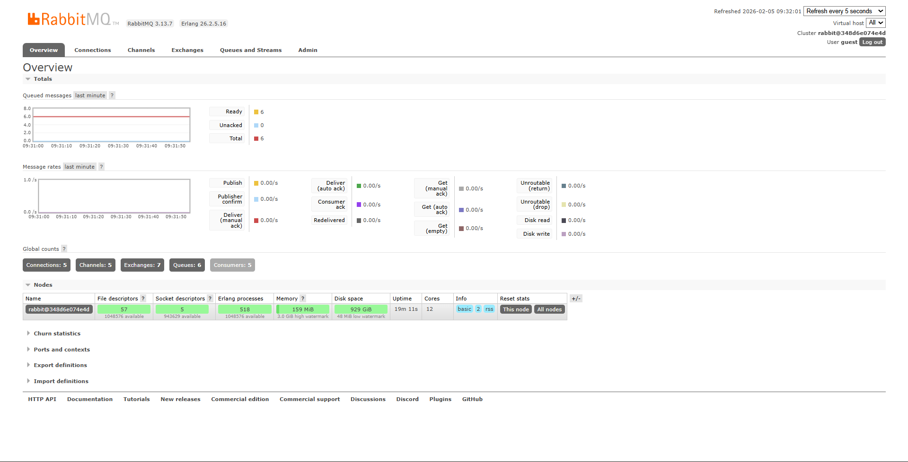
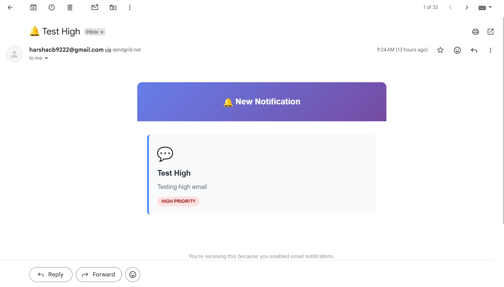
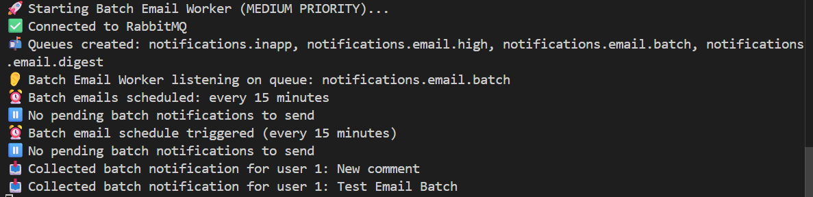

# 🔔 Real-Time Notification System

A production-grade notification system built with **message queues**, **priority-based delivery**, and **real-time WebSocket updates**. Designed to handle high-volume notifications with intelligent batching and user preferences.

## 🛠️ Tech Stack


---

## 📖 About The Project

This notification system demonstrates **production-level architecture** for handling notifications at scale. Instead of directly saving notifications to a database, the system uses **RabbitMQ message queues** to decouple notification creation from delivery, enabling:

- **Asynchronous processing** - API responds instantly while workers process notifications in the background
- **Priority-based delivery** - High-priority notifications bypass the queue
- **Scalability** - Multiple workers can consume from queues independently
- **Fault tolerance** - Failed deliveries are logged and can be retried
- **Smart batching** - Medium/low priority notifications are batched to avoid email spam

The system showcases real-world patterns used by companies like **LinkedIn, GitHub, and Slack** for managing user notifications.

---

## 🏗️ System Architecture

```
┌─────────────┐
│  React App  │ ← User interacts here
└──────┬──────┘
       │ HTTP / WebSocket
       ▼
┌─────────────────────────────────┐
│     Express API Server          │
│  • REST endpoints               │
│  • WebSocket server             │
│  • Preference checking          │
└──────┬──────────────────────────┘
       │ Publishes to queues
       ▼
┌─────────────────────────────────┐
│         RabbitMQ Queues         │
│  ┌──────────────────────────┐  │
│  │ notifications.inapp      │  │ → In-App Worker → WebSocket Push
│  │ notifications.email.high │  │ → Email Worker (instant)
│  │ notifications.email.batch│  │ → Batch Worker (every 15 mins)
│  │ notifications.email.digest│ │ → Digest Worker (every 3 hrs)
│  └──────────────────────────┘  │
└─────────────────────────────────┘
       │
       ▼
┌─────────────────────────────────┐
│      PostgreSQL Database        │
│  • notifications                │
│  • user_preferences             │
│  • notification_delivery_log    │
└─────────────────────────────────┘
```

### Priority-Based Routing

| Priority | In-App Delivery | Email Delivery |
|----------|----------------|----------------|
| 🔴 **High** | Instant (WebSocket) | Instant |
| 🟡 **Medium** | Instant (WebSocket) | Batched (every 15 mins) |
| 🔵 **Low** | Instant (WebSocket) | Daily Digest (every 3 hrs) |

---

## ✨ Features

### 🚀 Real-Time Notifications
- **WebSocket integration** for instant in-app notifications
- Notifications appear immediately without page refresh
- Unread badge updates in real-time

### 📊 Priority Queue System
- **High-priority notifications** processed first using RabbitMQ priority queues
- Ensures critical alerts (security, mentions) are never delayed
- Configurable priority levels: High, Medium, Low

### ⚙️ User Preferences
- **Granular control** over notification channels (in-app, email)
- **Type-based filtering** (comments, likes, mentions, follows)
- Preferences checked before sending to respect user choices

### 📧 Smart Email Delivery
- **High Priority**: Sent immediately
- **Medium Priority**: Batched every 15 minutes to reduce inbox clutter
- **Low Priority**: Daily digest summarizing all low-priority notifications
- Beautiful HTML email templates

### 📈 Delivery Tracking
- All deliveries logged to database
- Track success/failure for each channel
- Useful for debugging and analytics

### 🎨 Modern UI
- Clean, professional interface
- Notification bell with unread count
- Dropdown showing recent notifications
- Preferences management page
- Responsive design

---

## 🖼️ Results

### 1. Notification Bell & Real-Time Updates


### 2. User Preferences Dashboard


### 3. RabbitMQ Message Queues


### 4. Email Notifications


### 5. Batch Processing



---

## 🚀 Getting Started

### Prerequisites

- Node.js (v16+)
- PostgreSQL (v14+)
- Docker (for RabbitMQ)
- SendGrid account (free tier)

### Installation

1. **Clone the repository**
```bash
git clone https://github.com/yourusername/notification-system.git
cd notification-system
```

2. **Set up PostgreSQL database**
```bash
psql -U postgres
CREATE DATABASE notification_system;
\c notification_system
\i database/schema.sql
```

3. **Start RabbitMQ with Docker**
```bash
docker run -d --name rabbitmq -p 5672:5672 -p 15672:15672 rabbitmq:3-management
```

4. **Configure environment variables**
```bash
cd backend
cp .env.example .env
# Edit .env with your credentials
```

5. **Install dependencies**
```bash
# Backend
cd backend
npm install

# Frontend
cd ../frontend
npm install
```

### Running the Application

**You need 6 terminals:**

**Terminal 1 - Main Server**
```bash
cd backend
npm run dev
```

**Terminal 2 - In-App Worker**
```bash
cd backend
npm run worker:inapp
```

**Terminal 3 - High Priority Email Worker**
```bash
cd backend
npm run worker:email
```

**Terminal 4 - Batch Email Worker**
```bash
cd backend
npm run worker:batch
```

**Terminal 5 - Digest Email Worker**
```bash
cd backend
npm run worker:digest
```

**Terminal 6 - Frontend**
```bash
cd frontend
npm run dev
```

**Access the application:**
- Frontend: http://localhost:5173
- RabbitMQ UI: http://localhost:15672 (guest/guest)

---

## 📚 API Endpoints

### Notifications
- `POST /api/notifications` - Create notification
- `GET /api/notifications/user/:userId` - Get user notifications
- `GET /api/notifications/user/:userId/unread/count` - Get unread count
- `PUT /api/notifications/:id/read` - Mark as read
- `PUT /api/notifications/user/:userId/read-all` - Mark all as read

### Preferences
- `GET /api/preferences/:userId` - Get user preferences
- `PUT /api/preferences/:userId` - Update preferences

---

## 🧪 Testing the System

1. **Enable email notifications** in Preferences
2. **Send a HIGH priority notification** → Check email immediately
3. **Send 2-3 MEDIUM priority notifications** → Wait 15 mins, receive batch email
4. **Send several LOW priority notifications** → Wait for 3 hours, receive digest

---

## 🎯 Key Learnings & Design Decisions

### Why RabbitMQ?
- **Decouples** notification creation from delivery
- Handles traffic spikes gracefully
- Built-in **priority queues** for urgent notifications
- Enables horizontal scaling with multiple workers

### Why Batching/Digest?
- **Reduces email fatigue** - users don't get spammed
- **Improves open rates** - consolidated emails are more valuable
- **Saves costs** - fewer API calls to SendGrid
- Industry standard pattern (used by GitHub, LinkedIn, etc.)

### Why WebSockets?
- **Real-time updates** without polling
- **Efficient** - single persistent connection
- **Better UX** - notifications appear instantly

---

## 🔮 Future Enhancements

- [ ] Push notifications for mobile devices
- [ ] Multi-language support
- [ ] Notification scheduling
- [ ] SMS notifications via Twilio

---

